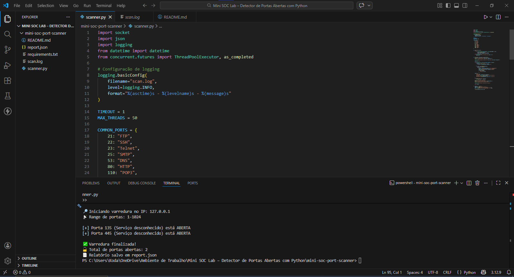

# 🔐 Mini SOC Lab - Port Scanner

Projeto desenvolvido para simular um mini laboratório de segurança (SOC),
com foco na identificação de portas abertas e geração de relatório estruturado.

---

## 🎯 Objetivo

Detectar serviços expostos em um host através da varredura de portas comuns,
gerando logs e relatório em formato JSON.

---

## 🛠 Tecnologias Utilizadas

- Python 3
- Socket (nativo)
- JSON
- Logging

---

## 📂 Estrutura do Projeto


mini-soc-lab-port-scanner/
│── scanner.py        # Script principal do scanner
│── report.json       # Relatório gerado automaticamente
│── scan.log          # Logs da execução
│── requirements.txt  # Dependências do projeto
│── README.md         # Documentação
│── docs/             # Imagens e evidências de execução

---

## 🚀 Como Executar

1. Clone o repositório:

```bash
git clone https://github.com/Paula-Tech007/mini-soc-lab-port-scanner.git

```

Entre na pasta do projeto:

```bash
cd mini-soc-lab-port-scanner

```

Execute o script:

```bash
python scanner.py
```

Digite o IP alvo quando solicitado.

📄 Saída Gerada

Exibição no terminal das portas abertas

Arquivo report.json com resultado estruturado

Arquivo scan.log com logs da execução

📑 Exemplo de Estrutura do report.json

```json
{
    "target": "127.0.0.1",
    "open_ports": [22, 80],
    "timestamp": "2026-02-19T14:32:10"

}
```


🔒 Observação Importante

Este projeto deve ser utilizado apenas para fins educacionais
e testes autorizados.

---

## 📈 Melhorias Implementadas

- ✔ Scanner TCP multithreaded
- ✔ Scan customizado por range de portas
- ✔ Logging estruturado
- ✔ Geração automática de relatório em JSON


---

## ▶️ Como Rodar (VS Code)

No terminal do VS Code:

```bash
python scanner.py
```

Teste primeiro com:

```
127.0.0.1
```

---

## 📸 Exemplo de Execução


